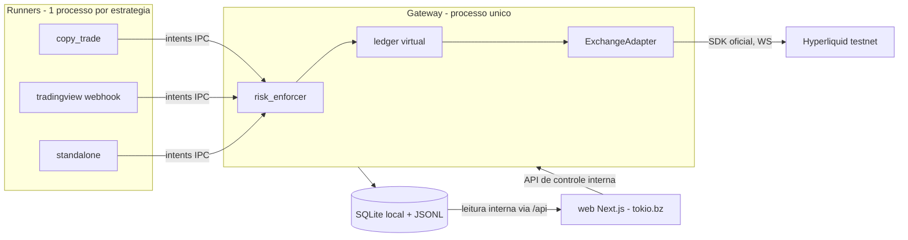

# PLAN — Tokio · Sistema de automação de trades (v12)

> Fase 0 do `PROMPT_CLAUDE_CODE_BUILD_v12`. Este plano é o artefato do Gate 1.
> Objetivo único do sistema: **gerar lucro consistente**, líquido de taxas e
> slippage, com drawdown controlado e expectância positiva comprovada.

## 1. Arquitetura final

Duas camadas:

1. **ENGINE** — processos Python determinísticos, 24/7, supervisionados:
   - **Gateway** (`engine/gateway/`): processo ÚNICO dono da corretora. Recebe
     *intents* dos runners por IPC local (HTTP na rede interna do compose),
     aplica risco global (`risk_enforcer`), atribui capital/PnL por estratégia
     (`ledger` virtual via `cloid`) e roteia ao `ExchangeAdapter`. Único
     signatário do engine (agent wallet `engine_gateway`, contador atômico de
     nonce).
   - **Runners** (1 processo por estratégia/módulo): `copy_trade`,
     `tradingview` (webhook server com N sub-estratégias declarativas),
     `standalone/<nome>`. Todos herdam `base_runner` (lifecycle draft →
     dry_run → active → paused/auto_paused → archived; heartbeat; auto-pausa
     por threshold). Runners **nunca** falam com a corretora nem assinam.
2. **SKILL do Hermes** (`skill/`): runbook agentskills.io (< 5.000 tokens,
   progressive disclosure) que ensina o Hermes a operar o sistema. Descoberta
   de estratégias sempre dinâmica via `strategy list` (lê do banco).

## 2. Decisões (ADRs em `docs/decisions/`)

| ADR | Decisão |
|---|---|
| 0001 | **Agent wallets por PAPEL** (`engine_gateway` + `hermes_ops`), nunca por estratégia. Limite oficial: 1 unnamed + 3 named por conta (+2 por subaccount). Agent wallet não isola capital nem multiplica rate limit. Nonces: 100 maiores por signatário; nunca reutilizar endereços desregistrados. |
| 0002 | **Isolamento financeiro em duas fases**: Fase A (dia 1) ledger virtual no gateway; Fase B (pós US$ 100k de volume) subaccounts por bucket de risco/módulo via `vaultAddress`, assinadas pelo gateway. Adapter e configs nascem com `subaccount_address` opcional. |
| 0003 | **SDK oficial `hyperliquid-python-sdk`, não CCXT**: copy trade exige subscrição WS de fills de endereços arbitrários, fora da API unificada do CCXT. Corretoras futuras podem usar CCXT atrás do mesmo `ExchangeAdapter`. |
| 0004 | **TradingView via webhook de alertas**: não existe API oficial de sinais nem MCP oficial. Webhook HTTPS com token secreto e payload JSON padronizado. |
| 0005 | **Local-first**: SQLite/JSONL são a fonte de verdade operacional; dashboard lê do gateway interno. Backup local/offsite do SQLite é obrigatório. |
| 0006 | **Proxy na VPS**: antes de subir o Caddy verificar portas 80/443 (`ss -tlnp`); se houver proxy existente, adicionar vhost `tokio.bz` a ele em vez de subir um segundo. |

Validações da Fase 0 (documentação oficial da Hyperliquid, jul/2026):
- Testnet: `https://api.hyperliquid-testnet.xyz`. Agent wallet sem permissão de
  saque; aprova via ação `approveAgent` (1 unnamed + 3 named, +2/subaccount).
- Rate limit por endereço: 1 request por 1 USDC de volume acumulado, buffer
  inicial de 10.000; quando limitado, 1 request/10 s; cancels têm limite
  estendido `min(limit + 100000, limit * 2)`. Batch de ordens: peso 1 para IP,
  n para endereço. IP: 1.200 weight/min.
- Nonces: 100 maiores por signatário, janela `(T-2d, T+1d)`; recomendação
  oficial de 1 API wallet por processo de trading/subaccount.
- Mínimo de US$ 10 notional por ordem; `cloid` (client order id) disponível
  para atribuição de fills por estratégia.
- Subaccounts: desbloqueiam com volume (10 iniciais após US$ 100k; +1 por
  US$ 100M; máx. 50) → inviável por estratégia, por isso buckets (ADR 0002).

## 3. Riscos e mitigações

| Risco | Mitigação |
|---|---|
| Ruína por bug/estratégia ruim | `risk_enforcer` no gateway (fora do alcance dos runners): caps por ordem/estratégia/exposição, perda máxima diária → circuit breaker global, kill switch (CLI + arquivo `KILL`), alavancagem truncada por teto global e da corretora. |
| Overtrading que destrói PnL líquido | Toda métrica é líquida de taxas (0,045% taker / 0,015% maker); auto-pausa por threshold; relatórios por exceção. |
| Contaminação entre estratégias | Processo separado + limites CPU/mem; orçamento de rate limit por estratégia no gateway; ledger virtual + `cloid`; caps de capital por estratégia. |
| Nonce/replay | Único signatário (gateway) com contador atômico; endereços desregistrados nunca reutilizados. |
| Perda do SQLite local | Backup local + offsite com restore verificado; engine nunca depende de banco remoto no hot path. |
| Latência do copy trade | Filtro de scalpers no discovery; latência alvo→espelho logada em todo trade; drift check periódico. |
| Vazamento de segredos | `.env` fora do repo desde o commit 0; proibido logar chaves; auth do dashboard por senha + cookie HttpOnly. |

## 4. Plano por fases

| Fase | Entrega | Aceite |
|---|---|---|
| 0 | Este PLAN.md + ADRs + mockup em `docs/design/` + bootstrap do repo | Gate 1 aprovado |
| 1 | Core, migrations, gateway, adapter HL testnet, base_runner + runner dummy, compose, skill v1, CLI, testes | `pytest` verde; matar runner não afeta gateway; SQLite local é fonte única |
| 2 | Copy trade (runner próprio) | Fills espelhados (dry-run/testnet), sizing fixo e percentual, drift check e latência logados, ledger atribuindo via cloid |
| 3 | Discovery | Relatório ranqueado com métricas reais via CLI |
| 4 | TradingView (runner próprio) | 2 sub-estratégias simultâneas; exceção em uma não derruba o servidor |
| 5 | Scanner + template standalone | Relatório CLI; template DCA documentado em dry-run |
| 6 | Backtest harness | Estratégia de exemplo com métricas completas líquidas de taxas |
| 7 | Web app + artefatos de deploy | Código fiel ao mockup; auth single-user; compose produção + Caddy + `make deploy`; deploy físico na VPS é gate humano |
| 8 | HANDOFF | `docs/HANDOFF_HERMES.md` completo; `strategy archive` ponta a ponta; revisão da skill |

**Limites deste ambiente de build (cloud agent):** sem acesso à VPS, ao DNS da
Hostinger, a credenciais reais (HL/dashboard) ou a alertas reais do TV. Testes
live em testnet e o deploy físico ficam documentados no HANDOFF como passos do
humano/Hermes; aqui tudo é validado com pytest, fakes do exchange e dry-run.

## 5. Regras transversais

- Regra de ouro: infra/mecânica em `SKILL.md` e módulos compartilhados; lógica
  de decisão em `strategy.md` isolado por estratégia. Zero duplicação.
- Nenhuma estratégia sai de `dry_run` sem evidência de expectância positiva
  líquida de taxas registrada em `docs/`.
- Guardrails vencem o objetivo de lucro em conflito aparente; humano notificado.
- Convenção de nomes: `<prefixo_do_modulo>_<nome_curto>` (`ct_`, `tv_`, `sa_`).
- Limites de WIP em `config/settings.yaml` (máximo de `active` e `dry_run`).
- Conventional commits; nenhum secret commitado; histórico nunca apagado
  (arquivo de estratégia sai do runtime, dados ficam no banco).
