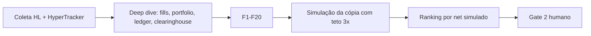

# Discovery logic v9 — referência canônica

## Filosofia

A v9 não seleciona o melhor trader; seleciona a melhor CÓPIA. A régua decisiva é o resultado simulado de espelhar a wallet com nosso capital ($1k), nosso teto de alavancagem (3x), nossas taxas, slippage e latência. Score, TWRR, win rate e janelas de PnL continuam visíveis, mas são informativos.

## Pipeline



## Fórmulas principais

- `ratio = mirror_capital / trader_equity`.
- `copy_notional = min(trader_notional * ratio, mirror_capital * max_copy_leverage)`.
- Se o notional for capado, o PnL do fill é escalado pelo mesmo fator do corte.
- Custo por perna = `copy_notional * (taker_fee_pct + slippage_pct + latency_slippage_pct) / 100`.
- Equity da cópia = capital inicial + PnL realizado líquido acumulado; o DD da cópia vem dessa curva.

## Limitações honestas

- Latência é modelada em bps fixos, sem tick data.
- Funding é ignorado.
- Só PnL realizado conta; lucro 100% não-realizado não qualifica.
- Fills truncados pelo limite da API reduzem cobertura e podem reprovar no F16.
- Simulação não substitui Gate 2 humano nem dry-run.

## Tabela de variáveis

| Chave | Significado | Valor | Por quê | Evidência/efeito |
|---|---|---|---|---|
| `logic_version` | versão da lógica de discovery que produziu as métricas | 11 | v11 abre o funil e expõe flexibilidade fina ao Hermes sem afrouxar F16-F19 | scan v10 real: 5000 → 150 → 1 aprovado; lab: aprovação ~1-2% do pool |
| `collection.leaderboard_top_n` | parâmetro de coleta/custo do scan | 5000 | mantido da v6/v5 para controlar universo e rate-limit | sem alteração v9; documentado para cobertura |
| `collection.deep_dive_max` | vagas principais do leaderboard no deep dive | 300 | v11 dobra o funil de entrada; Hermes pode ajustar volume | taxa histórica ~1-2%; 300 + quota externa deve trazer ~3-7 sugestões |
| `collection.external_dive_quota` | vagas extras reservadas a fontes externas | 60 | HyperTracker deixa de ser descartado quando o leaderboard enche o deep dive | corrige bug de starvation: antes slice `[:0]` descartava externos |
| `collection.external_interleave_after` | posição em que fontes externas entram na fila | 100 | fontes externas entram cedo o bastante para não morrerem por orçamento | se orçamento estourar, HyperTracker ainda foi testado |
| `collection.request_budget` | orçamento máximo de requests por scan | 2800 | cobre 300×~7 + quota externa + margem | scan frio estimado ~18-25 min com throttle 1.3s |
| `collection.min_request_interval_s` | intervalo mínimo entre requests HTTP | 1.3s | throttle ajustável pelo Hermes ao ampliar/reduzir scans | antes hardcoded no HLDataClient |
| `collection.min_equity_usd` | piso barato de equity no leaderboard | 1000 | alinhado ao piso F20; evita matar antes o que a banda aceita | F20 usa clearinghouse real depois do deep dive |
| `collection.sort_by` | parâmetro de coleta/custo do scan | pnl_7d | mantido da v6/v5 para controlar universo e rate-limit | sem alteração v9; documentado para cobertura |
| `collection.deep_sort_by` | ordenação dos candidatos que entram no deep dive | roi_30d | Hermes pode mudar o perfil do funil (`roi_30d`, `pnl_7d`, `equity_asc`) | equity_log foi o preditor mais forte do lab (ρ -0.227) |
| `collection.fills_window_days` | parâmetro de coleta/custo do scan | 60 | mantido da v6/v5 para controlar universo e rate-limit | sem alteração v9; documentado para cobertura |
| `collection.fills_max_pages` | parâmetro de coleta/custo do scan | 4 | mantido da v6/v5 para controlar universo e rate-limit | sem alteração v9; documentado para cobertura |
| `collection.cache_ttl_hours` | parâmetro de coleta/custo do scan | 20 | mantido da v6/v5 para controlar universo e rate-limit | sem alteração v9; documentado para cobertura |
| `collection.rekt_sample` | parâmetro de coleta/custo do scan | 20 | mantido da v6/v5 para controlar universo e rate-limit | sem alteração v9; documentado para cobertura |
| `collection.positioning_sample` | parâmetro de coleta/custo do scan | 15 | mantido da v6/v5 para controlar universo e rate-limit | sem alteração v9; documentado para cobertura |
| `collection.active_scan_enabled` | ligar varredura ativa legada | false | v11 desliga por padrão: implementação atual é stub alfabético | HyperTracker + fallback substituem expansão real nesta versão |
| `collection.active_scan_window_hours` | parâmetro de coleta/custo do scan | 48 | mantido da v6/v5 para controlar universo e rate-limit | sem alteração v9; documentado para cobertura |
| `collection.active_scan_max_addresses` | parâmetro de coleta/custo do scan | 200 | mantido da v6/v5 para controlar universo e rate-limit | sem alteração v9; documentado para cobertura |
| `collection.active_scan_min_notional_usd` | parâmetro de coleta/custo do scan | 1000 | mantido da v6/v5 para controlar universo e rate-limit | sem alteração v9; documentado para cobertura |
| `sources.hypertracker.enabled` | ativar HyperTracker como feed de endereços | true | aumenta pool sem delegar decisão | +274 endereços exclusivos; mediana +$11.79, hit 67% |
| `sources.hypertracker.api_key_env` | nome da variável de ambiente da chave | HYPERTRACKER_API_KEY | segredo fora do repo; sem chave = off silencioso | teste de fonte sem chave |
| `sources.hypertracker.max_addresses` | limite de candidatos do HyperTracker por scan | 300 | ~3-5 requests/scan dentro do free tier | free tier 100 req/dia; uso estimado < 5 |
| `sources.nansen_leaderboard.enabled` | fonte externa opcional de endereços candidatos | false | terceiros só alimentam wallets; métricas são nossas | sem dependência dura; flags off exceto HyperTracker |
| `sources.nansen_leaderboard.api_key_env` | fonte externa opcional de endereços candidatos | NANSEN_API_KEY | terceiros só alimentam wallets; métricas são nossas | sem dependência dura; flags off exceto HyperTracker |
| `sources.nansen_leaderboard.max_addresses` | fonte externa opcional de endereços candidatos | 100 | terceiros só alimentam wallets; métricas são nossas | sem dependência dura; flags off exceto HyperTracker |
| `sources.nansen_leaderboard.window_days` | fonte externa opcional de endereços candidatos | 30 | terceiros só alimentam wallets; métricas são nossas | sem dependência dura; flags off exceto HyperTracker |
| `sources.apify_hl_scraper.enabled` | fonte externa opcional de endereços candidatos | false | terceiros só alimentam wallets; métricas são nossas | sem dependência dura; flags off exceto HyperTracker |
| `sources.apify_hl_scraper.api_key_env` | fonte externa opcional de endereços candidatos | APIFY_TOKEN | terceiros só alimentam wallets; métricas são nossas | sem dependência dura; flags off exceto HyperTracker |
| `sources.apify_hl_scraper.actor` | fonte externa opcional de endereços candidatos | null | terceiros só alimentam wallets; métricas são nossas | sem dependência dura; flags off exceto HyperTracker |
| `sources.apify_hl_scraper.max_addresses` | fonte externa opcional de endereços candidatos | 100 | terceiros só alimentam wallets; métricas são nossas | sem dependência dura; flags off exceto HyperTracker |
| `entry_rule.min_positive_windows` | mínimo de janelas PnL positivas | 0 janelas | desativado: janelas de PnL quase não predizem lucro da cópia | Spearman windows_pos +0.075 |
| `entry_rule.required_windows` | janelas obrigatórias de PnL positivo | nenhuma | desativado; a entrada agora é por simulação da cópia | v9: F16-F19 substituem regra de entrada |
| `hard_filters.f1_recent_activity_days` | atividade recente máxima para não considerar abandonado | 7 dias | v10: voltou para 7 (era 21 na v9 — 21 deixava passar traders parados há 3 semanas) | h11/h12: afrouxar atividade aumentou pool sem quebrar direção |
| `hard_filters.f2_min_closed_trades` | amostra mínima de trades fechados | 15 trades | amostra suficiente para simulação sem matar demais o pool | lab: F2=30 matava candidatos antes do ranking |
| `hard_filters.f2b_min_trades_30d` | atividade mínima nos 30d | 3 trades | mantém sinal recente mínimo | lab: simulação decide a qualidade |
| `hard_filters.f2c_min_trades_7d` | atividade mínima nos 7d | 2 trades | v11 deixa swing traders de 2-4 closes/semana entrarem no funil | F1 ainda mata wallet parada; sweet spot começa em 0.3 trades/dia |
| `hard_filters.f3_min_avg_holding_hours` | filtro binário do funil | null | regra herdada/versionada; null desativa sem apagar código | evidência histórica no changelog v2-v8; não é foco novo v9 |
| `hard_filters.f3_max_trades_per_day` | filtro binário do funil | null | regra herdada/versionada; null desativa sem apagar código | evidência histórica no changelog v2-v8; não é foco novo v9 |
| `hard_filters.f4_min_twrr_30d_pct` | filtro binário do funil | null | regra herdada/versionada; null desativa sem apagar código | evidência histórica no changelog v2-v8; não é foco novo v9 |
| `hard_filters.f5_max_drawdown_90d_pct` | teto de sanidade do DD do trader | 80% | DD do trader não é o risco da cópia; 80% só corta quase-liquidado | Spearman max_dd_90d +0.105 (invertido) — F19 substitui risco |
| `hard_filters.f5_dd_quality_bands` | filtro binário do funil | `[[0, 20, 1.0], [20, 30, 0.7], [30, 40, 0.4]]` | regra herdada/versionada; null desativa sem apagar código | evidência histórica no changelog v2-v8; não é foco novo v9 |
| `hard_filters.f6_max_top3_pnl_concentration` | filtro binário do funil | 0.5 | regra herdada/versionada; null desativa sem apagar código | evidência histórica no changelog v2-v8; não é foco novo v9 |
| `hard_filters.f7_max_avg_leverage` | filtro binário do funil | 15.0 | regra herdada/versionada; null desativa sem apagar código | evidência histórica no changelog v2-v8; não é foco novo v9 |
| `hard_filters.f7b_max_current_leverage` | filtro binário do funil | 10.0 | regra herdada/versionada; null desativa sem apagar código | evidência histórica no changelog v2-v8; não é foco novo v9 |
| `hard_filters.f12_min_available_margin_pct` | filtro binário do funil | null | regra herdada/versionada; null desativa sem apagar código | evidência histórica no changelog v2-v8; não é foco novo v9 |
| `hard_filters.f13_min_liq_distance_pct` | filtro binário do funil | 15.0 | regra herdada/versionada; null desativa sem apagar código | evidência histórica no changelog v2-v8; não é foco novo v9 |
| `hard_filters.f8_min_liquid_volume_share` | filtro binário do funil | 0.8 | regra herdada/versionada; null desativa sem apagar código | evidência histórica no changelog v2-v8; não é foco novo v9 |
| `hard_filters.f8_liquid_assets_top_n` | top N ativos por volume 24h considerados líquidos | 40 | F8 era gargalo calibrável; amplia universo sem remover share mínimo | diagnóstico 2026-07-04 recomendou 25→40 |
| `hard_filters.f9_mm_max_trades_per_day` | filtro binário do funil | 200.0 | regra herdada/versionada; null desativa sem apagar código | evidência histórica no changelog v2-v8; não é foco novo v9 |
| `hard_filters.f9_mm_max_pnl_over_volume` | filtro binário do funil | 0.0001 | regra herdada/versionada; null desativa sem apagar código | evidência histórica no changelog v2-v8; não é foco novo v9 |
| `hard_filters.f9_mm_min_tpd_for_pnl_vol` | mínimo de trades/dia para regra PnL/volume do F9 | 50.0 | v11 expõe parâmetro antes hardcoded | permite ao Hermes calibrar anti-MM sem código |
| `hard_filters.f9_mm_max_neutral_exposure` | exposição líquida máxima para classificar delta-neutro | 0.02 | v11 expõe parâmetro antes hardcoded | permite ao Hermes calibrar anti-arb/vault |
| `hard_filters.f9_mm_min_tpd_for_neutral` | mínimo de trades/dia para regra delta-neutra | 20.0 | v11 expõe parâmetro antes hardcoded | permite ajuste fino de perfis neutros |
| `hard_filters.f10_max_deposit_growth_share` | filtro binário do funil | 0.5 | regra herdada/versionada; null desativa sem apagar código | evidência histórica no changelog v2-v8; não é foco novo v9 |
| `hard_filters.f11_min_mirror_notional_usd` | filtro binário do funil | 10.0 | regra herdada/versionada; null desativa sem apagar código | evidência histórica no changelog v2-v8; não é foco novo v9 |
| `hard_filters.f11_mirror_capital_usd` | filtro binário do funil | 1000.0 | regra herdada/versionada; null desativa sem apagar código | evidência histórica no changelog v2-v8; não é foco novo v9 |
| `hard_filters.f15_sim_window_days` | filtro binário do funil | 30 | regra herdada/versionada; null desativa sem apagar código | evidência histórica no changelog v2-v8; não é foco novo v9 |
| `hard_filters.f15_min_net_pnl_usd` | filtro binário do funil | 0.0 | regra herdada/versionada; null desativa sem apagar código | evidência histórica no changelog v2-v8; não é foco novo v9 |
| `hard_filters.f16_min_coverage_days` | cobertura mínima entre primeiro e último fill | 30 dias | impede wallet de 5 dias parecer consistente | auditoria top 1: +250% com só 5 dias |
| `hard_filters.f17_min_sim_net_usd` | lucro líquido mínimo da cópia simulada | $10 | a cópia precisa pagar mais que ruído/custos | quintil superior de sim A: mediana +$71 em B |
| `hard_filters.f18_sim_positive_halves` | exigir edge nas metades da janela | true | mata sortudo de uma perna só | corte 2: mediana foi de -$94 para +$770 |
| `hard_filters.f19_max_sim_dd_pct` | drawdown máximo da curva da cópia simulada | 25% | risco que importa é o da cópia | perdedores tinham DD 56–75% já visível em A |
| `hard_filters.f20_min_trader_equity_usd` | piso de equity real do trader | $1k | v11 transforma F20 em banda testável pelo Hermes | `null` remove o piso; alinhar com `collection.min_equity_usd` |
| `hard_filters.f20_max_trader_equity_usd` | teto de equity real do trader | $100k | devolve pool sem reabrir baleias; F11 mede executabilidade real | lab validou $150k; $100k é meio-termo operacional |
| `copy_simulation.window_days` | janela de replay da cópia | 60 dias | usa histórico cheio de fills; metades de 30d | h13/h15: duas metades foram preditivas |
| `copy_simulation.latency_slippage_pct` | custo estimado de latência por perna | 0.03% | modelo simples para 200ms–2s sem tick data | laboratório desconta esse custo em todo replay |
| `copy_simulation.max_copy_leverage` | teto de alavancagem da nossa cópia | 3x | equilíbrio entre executabilidade e sobrevivência | corrige top 1: fill virava 128x sem teto |
| `copy_simulation.factor_floor` | parâmetro da simulação de cópia | 0.5 | modelo de replay da cópia com nosso sizing/custos | validado no laboratório walk-forward |
| `copy_simulation.factor_cap` | parâmetro da simulação de cópia | 1.2 | modelo de replay da cópia com nosso sizing/custos | validado no laboratório walk-forward |
| `score_weights.consistency` | peso do score informativo | 0.25 | score preservado para análise, não ranking final v9 | score v8 Spearman +0.125 |
| `score_weights.profit_factor` | peso do score informativo | 0.2 | score preservado para análise, não ranking final v9 | score v8 Spearman +0.125 |
| `score_weights.roi_log` | peso do score informativo | 0.15 | score preservado para análise, não ranking final v9 | score v8 Spearman +0.125 |
| `score_weights.drawdown_quality` | peso do score informativo | 0.15 | score preservado para análise, não ranking final v9 | score v8 Spearman +0.125 |
| `score_weights.copyability` | peso do score informativo | 0.15 | score preservado para análise, não ranking final v9 | score v8 Spearman +0.125 |
| `score_weights.net_expectancy` | peso do score informativo | 0.1 | score preservado para análise, não ranking final v9 | score v8 Spearman +0.125 |
| `score_adjustments.full_consistency_bonus` | ajuste pós-score informativo | 5 | mantido para dossiê e auditoria histórica | score não decide aprovação v9 |
| `score_adjustments.liq_distance_penalty` | ajuste pós-score informativo | -10 | mantido para dossiê e auditoria histórica | score não decide aprovação v9 |
| `score_adjustments.liq_distance_threshold_pct` | ajuste pós-score informativo | 20.0 | mantido para dossiê e auditoria histórica | score não decide aprovação v9 |
| `score_adjustments.crowding_penalty` | ajuste pós-score informativo | -5 | mantido para dossiê e auditoria histórica | score não decide aprovação v9 |
| `score_adjustments.crowding_top_n` | ajuste pós-score informativo | 20 | mantido para dossiê e auditoria histórica | score não decide aprovação v9 |
| `score_adjustments.min_score_for_suggestion` | piso mínimo do score para sugerir | 0 | score vira informativo; simulação decide | score completo Spearman +0.125, inferior à simulação nos extremos |
| `score_adjustments.pf_absurd_penalty` | ajuste pós-score informativo | -5 | mantido para dossiê e auditoria histórica | score não decide aprovação v9 |
| `score_adjustments.pf_absurd_threshold` | ajuste pós-score informativo | 10.0 | mantido para dossiê e auditoria histórica | score não decide aprovação v9 |
| `copyability.hold_sweet_spot_hours` | heurística de copiabilidade informativa | `[4, 72]` | proxy mantido, mas simulação é a métrica real | copyability Spearman +0.044 |
| `copyability.freq_sweet_spot_trades_day` | heurística de copiabilidade informativa | `[0.3, 20.0]` | proxy mantido, mas simulação é a métrica real | copyability Spearman +0.044 |
| `cost_of_copy.taker_fee_pct` | taxa taker por perna | 0.045% | custo da HL usado na simulação | descontado em simulate_copy |
| `cost_of_copy.slippage_pct` | slippage base por perna | 0.02% | custo conservador base | descontado em simulate_copy |
| `cohorts.size_bands.Shrimp` | faixa de coorte/rotulagem | 250 | rótulo informativo e comparável ao HyperTracker | não decide aprovação v9 |
| `cohorts.size_bands.Fish` | faixa de coorte/rotulagem | 10000 | rótulo informativo e comparável ao HyperTracker | não decide aprovação v9 |
| `cohorts.size_bands.Dolphin` | faixa de coorte/rotulagem | 100000 | rótulo informativo e comparável ao HyperTracker | não decide aprovação v9 |
| `cohorts.size_bands.Whale` | faixa de coorte/rotulagem | 5000000 | rótulo informativo e comparável ao HyperTracker | não decide aprovação v9 |
| `cohorts.size_bands.Leviathan` | faixa de coorte/rotulagem | inf | rótulo informativo e comparável ao HyperTracker | não decide aprovação v9 |
| `cohorts.pnl_bands.Rekt` | faixa de coorte/rotulagem | 0 | rótulo informativo e comparável ao HyperTracker | não decide aprovação v9 |
| `cohorts.pnl_bands.Flat` | faixa de coorte/rotulagem | 1000 | rótulo informativo e comparável ao HyperTracker | não decide aprovação v9 |
| `cohorts.pnl_bands.Printer` | faixa de coorte/rotulagem | inf | rótulo informativo e comparável ao HyperTracker | não decide aprovação v9 |

## Como reproduzir a validação

```bash
.venv/bin/python -m research.discovery_lab.evaluate --label v9_final --cuts 4 --top-k 10
.venv/bin/python -m research.discovery_lab.analyze
.venv/bin/python -m research.discovery_lab.select_now --config /dev/null
```
